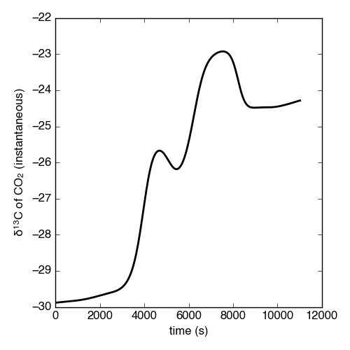

Comprehensive Walkthrough
=========================
The following examples should form a comprehensive walkthough of downloading the package, getting thermogram data into the right form for importing, running the DAEM inverse model, peak-fitting the activation energy (Ea) probability density function, determining the isotope composition of each component, and performing Monte Carlo isotope uncertainty estimates.

For detailed information on class attributes, methods, and parameters, consult the `Package Reference Documentation` or use the ``help()`` command from within Python.

Quick guide
-----------

Basic runthrough::

	#import modules
	import matplotlib.pyplot as plt
	import numpy as np
	import pandas as pd
	import rampedpyrox as rp

	#generate string to data
	tg_data = '/folder_containing_data/tg_data.csv'
	iso_data = '/folder_containing_data/iso_data.csv'

	#make the thermogram instance
	tg = rp.RpoThermogram.from_csv(
		tg_data,
		bl_subtract = True,
		nt = 250)

	#generate the DAEM
	daem = rp.Daem.from_timedata(
		tg,
		log10k0 = 10, #assume a constant value of 10
		Ea_max = 350,
		Ea_min = 50,
		nEa = 400)

	#run the inverse model to generate energy complex
	ec = rp.EnergyComplex.inverse_model(
		daem, 
		tg,
		combined = [(1,2), (6, 7)],
		nPeaks = 'auto',
		omega = 3,
		peak_shape = 'Gaussian',
		thres = 0.02)

	#forward-model back onto the thermogram
	tg.forward_model(daem, ec)

	#make the isotope results instance
	ri = rp.RpoIsotopes.from_csv(
		iso_data,
		blk_corr = True, #uses values for NOSAMS instrument
		mass_err = 0.01)

	#fit the component isotope values and uncertainty
	ri.fit(
		daem, 
		ec, 
		tg,
		DEa = 0.0018, #uses values for NOSAMS instrument
		nIter = 10000)

Downloading the package
-----------------------

Using the ``pip`` package manager
~~~~~~~~~~~~~~~~~~~~~~~~~~~~~~~~~
``rampedpyrox`` and the associated dependencies can be downloaded directly from the command line using ``pip``::

	$ pip install rampedpyrox

You can check that your installed version is up to date with the latest release by doing::

	$ pip freeze

**This option will become available once the peer-reviewed manuscripts accompanying this package have been published.**

Downloading from source
~~~~~~~~~~~~~~~~~~~~~~~
Alternatively, ``rampedpyrox`` source code can be downloaded directly from `my github repo <http://github.com/FluvialSeds/rampedpyrox>`_. Or, if you have git installed::

	$ git clone git://github.com/FluvialSeds/rampedpyrox.git

And keep up-to-date with the latest version by doing::

	$ git pull

from within the rampedpyrox directory.

**This github repo is currently private until the peer-reviewed manuscripts accompanything this package have been published.** Please `contact me directly <jhemingway@whoi.edu>`_ for access.

Dependencies
~~~~~~~~~~~~
The following packages are required to run ``rampedpyrox``:

* `python <http://www.python.org>`_ >= 2.7, including Python 3.x

* `matplotlib <http://matplotlib.org>`_ >= 1.5.2

* `numpy <http://www.numpy.org>`_ >= 1.11.1

* `pandas <http://pandas.pydata.org>`_ >= 0.18.1

* `scipy <http://www.scipy.org>`_ >= 0.18.0

If downloading using ``pip``, these dependencies (except python) are installed
automatically.

Optional Dependencies
~~~~~~~~~~~~~~~~~~~~~
The following packages are not required but are highly recommended:

* `ipython <http://www.ipython.org>`_ >= 4.1.1

Additionally, if you are new to the Python environment or programming using the command line, consider using a Python integrated development environment (IDE) such as:

* `wingware <http://wingware.com>`_

* `Enthought Canopy <https://store.enthought.com/downloads/#default>`_

* `Anaconda <https://www.continuum.io/downloads>`_

* `Spyder <https://github.com/spyder-ide/spyder>`_

Python IDEs provide a "MATLAB-like" environment as well as package management. This option should look familiar for users coming from a MATLAB or RStudio background.

Getting data in the right format
--------------------------------

Importing thermogram data
~~~~~~~~~~~~~~~~~~~~~~~~~
For thermogram data, this package requires that the file is in `.csv` format, that the first column is `date_time` index in an **hh:mm:ss AM/PM** format, and that the file contains 'CO2_scaled' and 'temp' columns [1]_. For example:

+-------------+------------+--------------+
|  date_time  |    temp    |  CO2_scaled  |
+=============+============+==============+
|10:24:20 AM  |  100.05025 |    4.6       |
+-------------+------------+--------------+
|10:24:21 AM  |  100.09912 |    5.3       |
+-------------+------------+--------------+
|10:24:22 AM  |  100.11413 |    5.1       |
+-------------+------------+--------------+
|10:24:23 AM  |  100.22759 |    4.9       |
+-------------+------------+--------------+

Once the file is in this format, generate a string pointing to it in python 
like this::

	#create string of path to data
	all_data = '/path_to_folder_containing_data/all_data.csv'

Importing isotope data
~~~~~~~~~~~~~~~~~~~~~~
If you are importing isotope data, this package requires that the file is in `.csv` format and that the first two rows correspond to the starting time of the experiment and the initial trapping time of fraction 1, respectively. Additionally, the file must contain a 'fraction' column and isotope/mass columns must have `ug_frac`, `d13C`, `d13C_std`, `Fm`, and `Fm_std` headers [2]_. For example:

+-------------+----------+---------+--------+----------+--------+----------+
|  date_time  | fraction | ug_frac |  d13C  | d13C_std |   Fm   |  Fm_std  |
+=============+==========+=========+========+==========+========+==========+
|10:24:20 AM  |    -1    |    0    |    0   |    0     |    0   |     0    |
+-------------+----------+---------+--------+----------+--------+----------+
|10:45:10 AM  |     0    |    0    |    0   |    0     |    0   |     0    |
+-------------+----------+---------+--------+----------+--------+----------+
|11:32:55 AM  |     1    |  69.05  | -30.5  |   0.1    | 0.8874 |  0.0034  |
+-------------+----------+---------+--------+----------+--------+----------+
|11:58:23 AM  |     2    | 105.81  | -29.0  |   0.1    | 0.7945 |  0.0022  |
+-------------+----------+---------+--------+----------+--------+----------+

Here, the `ug_frac` column is composed of manometrically determined masses rather than those determined by the infrared gas analyzer (IRGA, *i.e.* photometric). As such, the mass RMSE value determined by the fitting procedure (see `Determining component isotope composition`_ below) is a metric of the discrepancy between photometric and manometric mass measurements in addition to that between the peak-fitted and true thermograms.

**Important:** The `date_time` value for fraction '-1' must be the same as the `date_time` value for the first row in the `all_data` thermogram file **and** the value for fraction '0' must the initial time when trapping for fraction 1 began.

Once the file is in this format, generate a string pointing to it in python like this::

	#create string of path to data
	sum_data = '/path_to_folder_containing_data/sum_data.csv'

Making a TimeData instance (the Thermogram)
-------------------------------------------
Once the `all_data` string been defined, you are ready to import the package and generate an ``rp.RpoThermogram`` instance containing the thermogram data. ``rp.RpoThermogram`` is a subclass of ``rp.TimeData`` -- broadly speaking, this handles any object that contains measured time-series data. It is important to keep in mind that your thermogram will be down-sampled to `nt` points in order to smooth out high-frequency noise and to keep Laplace transform matrices to a manageable size for inversion (see `Setting-up the model`_ below). Additionally, because the inversion model is sensitive to boundary conditions at the beginning and end of the run (see `Deconvolving rate data into peaks`_ below), there is an option when generating the thermogram instance to ensure that the baseline has been subtracted, as well as options for inputting measurement uncertainty (time data uncertainty is currently unused as of v.0.0.2)::

	#load modules
	import rampedpyrox as rp

	#number of timepoints to be used in down-sampled thermogram
	nt = 250

	tg = rp.RpoThermogram.from_csv(
		data,
		bl_subtract = True, #subtract baseline
		nt = nt,
		ppm_CO2_err = 5, #IRGA measurement uncertainty
		T_err = 1) #thermocouple uncertainty

Plot the thermogram and the fraction of carbon remaining against temperature [3]_ or time::

	#load modules
	import matplotlib.pyplot as plt

	#make a figure
	fig, ax = plt.subplots(2, 2, 
		figsize = (8,8), 
		sharex = 'col')

	#plot results
	ax[0, 0] = tg.plot(
		ax = ax[0, 0], 
		xaxis = 'time',
		yaxis = 'rate')

	ax[0, 1] = tg.plot(
		ax = ax[0, 1], 
		xaxis = 'temp',
		yaxis = 'rate')

	ax[1, 0] = tg.plot(
		ax = ax[1, 0], 
		xaxis = 'time',
		yaxis = 'fraction')

	ax[1, 1] = tg.plot(
		ax = ax[1, 1], 
		xaxis = 'temp',
		yaxis = 'fraction')

	#adjust the axes
	ax[0, 0].set_ylim([0, 0.00032])
	ax[0, 1].set_ylim([0, 0.0035])
	ax[1, 1].set_xlim([375, 1200])

	plt.tight_layout()

Resulting plots look like this:

|realdata|

Setting-up the model
--------------------

The Laplace transform
~~~~~~~~~~~~~~~~~~~~~
Once the ``rp.RpoThermogram`` instance has been created, you are ready to run the inversion model and generate a regularized and discretized probability density function (pdf) of the rate/activation energy distribution, `f` [4]_. For non-isothermal thermogram data, this is done using a first-order Distributed Activation Energy Model (DAEM) [5]_ by generating an ``rp.Daem`` instance containing the proper Laplace Transform matrix, `A`, to translate between time and activation energy space. This matrix contains all the assumptions that go into building the DAEM inverse model as well as all of the information pertaining to experimental conditions (*e.g.* ramp rate) [6]_. Importantly, the Laplace transform matrix does not contain any information about the sample itself -- it is simply the model "design" -- and a single ``rp.Daem`` instance can be used for multiple samples provided they were analyzed under identical experimental conditions.

One critical user input for the DAEM is the Arrhenius pre-exponential factor, *k\ :sub:`0`* (inputted here in log\ :sub:`10`\  form). Because there is much discussion in the literature over the constancy and best choice of this parameter (the so-called 'kinetic compensation effect' or KCE [7]_), this package allows *log\ :sub:`10`\ k\ :sub:`0`* to be inputted as a constant, an array, or a function of Ea.

For convenience, you can create any model directly from either time data or rate data, rather than manually inputting time, temperature, and rate vectors. Here, I create a DAEM using the thermogram defined above and allow Ea to range from 50 to 400 kJ/mol::

	#define log10k0, assume constant value of 10
	log10k0 = 10

	#define Ea range (in kJ/mol)
	Ea_min = 50
	Ea_max = 400
	nEa = 400 #number of points in the vector

	#create the DAEM instance
	daem = rp.Daem.from_timedata(
		tg,
		log10k0 = log10k0,
		Ea_max = Ea_max,
		Ea_min = Ea_min,
		nEa = nEa)

Regularizing the inversion
~~~~~~~~~~~~~~~~~~~~~~~~~~
Once the model has been created, you must tell the package how much to 'smooth' the resulting f(Ea) distribution. This is done by choosing an `omega` value to be used as a smoothness weighting factor for Tikhonov regularization [8]_. Higher values of `omega` increase how much emphasis is placed on minimizing changes in the first derivative at the expense of a better fit to the measured data, which includes analytical uncertainty. Rractically speaking, regularization aims to "fit the data while ignoring the noise." This package can calculate a best-fit `omega` value using the L-curve method [6]_.

Here, I calculate and plot L curve for the thermogram and model defined above::

	#make a figure
	fig,ax = plt.subplots(1, 1,
		figsize = (5, 5))

	om_best, ax = daem.calc_L_curve(rd, ax = ax)

	plt.tight_layout()

Resulting L-curve plot looks like this, here with a calculated best-fit omega
value of 0.448:

|lcurve|

**Important:** Best-fit `omega` values generated by the L-curve method typically under-regularize f(Ea) when used for Ramped PyrOx isotope deconvolution. That is, f(Ea) distributions will contain more peaks than can be resolved using the ~5-7 CO\ :sub:`2`\  fractions typically collected during a Ramped PyrOx run. This can be partially addressed by combining peaks when deconvolving the rate data using the ``comine`` flag (see `Deconvolving rate data into peaks`_ below) [9]_.  Alternatively, you can increase the `omega` value (a value of ~1-5 will result in ~5-6 Gaussian peaks for most samples).

Making a RateData instance (the inversion results)
--------------------------------------------------
After creating the ``rp.Daem`` instance and deciding on a value for `omega`, you are ready to invert the thermogram and generate an Activation Energy Complex (EC). An EC is a subclass of the more general ``rp.RateData`` instance which, broadly speaking, contains all rate and/or activation energy information. That is, the EC contains an estimate of the underlying Ea distribution, f(Ea), that is intrinsic to a particular sample for a particular degradation experiment type (*e.g.* combustion, *uv* oxidation, enzymatic degradation, etc.). A fundamental facet of this model is the realization that each distribution is composed of a sum of individual peaks, each with unique mean Ea values, isotope composition, and molecular compositions.

Deconvolving rate data into peaks
~~~~~~~~~~~~~~~~~~~~~~~~~~~~~~~~~
The next step is to deconvolve the inverse-modeled rate data distribution into individual peaks. It is important to realize that, until now, the model has made no assumptions about the shape of f(Ea) or the individual peaks that is comprises. The fact that the regularized f(Ea) resembles a sum of Gaussian peaks appears to be a fundamental property of complex organic carbon mixtures, as has been discussed before [10]_. 

Generating the ``rp.EnergyComplex`` instance using the inverse model will automatically deconvolve f(Ea) into a sum of peaks. Here we can add user-inputted information for performing the deconvolution: 

* the ``omega`` value used for regulariation (see `Regularizing the inversion`_ above).

* the shape of the underlying peaks, ``peak_shape`` (only 'Gaussian' is supported as of v.0.0.2).

* the number of peaks to retain by the model (``nPeaks``), either as an integer or 'auto'. Peaks are automatically detected according to the curvature of f(Ea) -- each unique concave-down region is assumed to contain a single peak. Peaks below the relative threshold cutoff, ``thres``, are ignored (*e.g.* for the below example, anything below 2% of the largest peak). A higher value of `omega` will lead to less detectable peaks.

* which, if any, peaks to combine (``combined``). Sometimes the maximum number of peaks whose unique isotope composition can be determined is limited due to low isotope measurement resolution (see `Determining component isotope composition`_ below). Typically, this occurs when two or more peaks reside exclusively within a single isotope measurement region. (*e.g.* for the below example, the pairs 1 & 2 and 6 & 7 are combined) [9]_.

Here I create two energy complexes, one with `omega` set to 'auto' and no peaks combined, and the other with `omega` set to 3 and two pairs of peaks combined, and perform the deconvolution by inverse modeling the above thermogram::

	ec_auto = rp.EnergyComplex.inverse_model(
		daem, 
		tg,
		combined = None,
		nPeaks = 'auto',
		omega = 'auto',
		peak_shape = 'Gaussian',
		thres = 0.02)

	ec_3 = rp.EnergyComplex.inverse_model(
		daem, 
		tg,
		combined = [(1,2), (6,7)],
		nPeaks = 'auto',
		omega = 3,
		peak_shape = 'Gaussian',
		thres = 0.02)

Plot the resulting deconvolved energy complex::

	#make a figure
	fig,ax = plt.subplots(1, 2, 
		figsize = (8,5),
		sharey = True)

	#plot results
	ax[0] = ec_auto.plot(ax = ax[0])
	ax[1] = ec_3.plot(ax = ax[1])

	ax[0].set_title("omega = 'auto'")
	ax[1].set_title("omega = 3")

	ax[0].set_ylim([0, 0.022])
	plt.tight_layout()

Resulting plots are shown side-by-side:

|phis|

Note that the number of peaks reported in the legend is before the ``combined`` flag has been implemented. The first and last pairs of peaks are shown combined in the `omega = 3` plot but counted separately in the legend.

A summary of the peaks can be printed with the ``peak_info`` attribute and saved to a `.csv` file::

	ec_3.peak_info
	ec_3.peak_info.to_csv('EC_peak_info_file.csv')

This will print a table similar to:

+-------------------------------------------------------------+
|Information for each deconvolved peak:                       |
+=====+=============+================+==========+=============+
|     | mu (kJ/mol) | sigma (kJ/mol) |  height  |  rel. area  |
+-----+-------------+----------------+----------+-------------+
|  1  |  134.36     |   7.75         | 3.87e-3  |  0.08       |
+-----+-------------+----------------+----------+-------------+
|  2  |  151.81     |   8.62         | 9.95e-3  |  0.21       |
+-----+-------------+----------------+----------+-------------+
|  3  |  175.25     |   9.46         | 6.99e-3  |  0.17       |
+-----+-------------+----------------+----------+-------------+
|  4  |  202.60     |   9.96         | 6.43e-3  |  0.16       |
+-----+-------------+----------------+----------+-------------+
|  5  |  228.73     |   8.29         | 1.54e-3  |  0.32       |
+-----+-------------+----------------+----------+-------------+
|  6  |  262.32     |   6.18         | 2.41e-3  |  0.04       |
+-----+-------------+----------------+----------+-------------+
|  7  |  282.85     |   7.89         | 1.32e-3  |  0.03       |
+-----+-------------+----------------+----------+-------------+

Additionally, the deconvolution RMSE can be printed as a metric of the quality of the fit::

	print(ec_3.rmse)

Forward modeling the estimated thermogram
~~~~~~~~~~~~~~~~~~~~~~~~~~~~~~~~~~~~~~~~~
Once the ``rp.EnergyComplex`` instance has been created, you can forward-model the predicted thermogram and compare with measured data using the ``forward_model`` method of any ``rp.TimeData`` instance. Here, I'll forward model the results from the `omega = 3` energy complex::

	tg.forward_model(daem, ec_3)

The thermogram is now updated with modeled data and can be plotted::
	
	#make a figure
	fig, ax = plt.subplots(2, 2, 
		figsize = (8,8), 
		sharex = 'col')

	#plot results
	ax[0, 0] = tg.plot(
		ax = ax[0, 0], 
		xaxis = 'time',
		yaxis = 'rate')

	ax[0, 1] = tg.plot(
		ax = ax[0, 1], 
		xaxis = 'temp',
		yaxis = 'rate')

	ax[1, 0] = tg.plot(
		ax = ax[1, 0], 
		xaxis = 'time',
		yaxis = 'fraction')

	ax[1, 1] = tg.plot(
		ax = ax[1, 1], 
		xaxis = 'temp',
		yaxis = 'fraction')

	#adjust the axes
	ax[0, 0].set_ylim([0, 0.00032])
	ax[0, 1].set_ylim([0, 0.0035])
	ax[1, 1].set_xlim([375, 1200])

	plt.tight_layout()

Resulting plot looks like this:

|modeleddata|

Similar to ``rp.EnergyComplex``, you can print and save a summary of the components::

	tg.cmpt_info
	tg.peak_info.to_csv('tg_peak_info_file.csv')

Which will print a table similar to:

+---------------------------------------------------------------------------------+
|Information for each deconvolved component:                                      |
+=====+===========+===========+===================+===================+===========+
|     | t max (s) | T max (K) | max rate (frac/s) | max rate (frac/K) | rel. area |
+-----+-----------+-----------+-------------------+-------------------+-----------+
|  1  | 3200.73   | 622.70    | 1.82e-4           | 2.25e-3           | 0.29      |
+-----+-----------+-----------+-------------------+-------------------+-----------+
|  2  | 4481.02   | 728.72    | 1.17e-4           | 1.36e-3           | 0.17      |
+-----+-----------+-----------+-------------------+-------------------+-----------+
|  3  | 5717.17   | 832.23    | 1.05e-4           | 1.31e-3           | 0.16      |
+-----+-----------+-----------+-------------------+-------------------+-----------+
|  4  | 7041.61   | 943.25    | 2.24e-4           | 2.66e-3           | 0.32      |
+-----+-----------+-----------+-------------------+-------------------+-----------+
|  5  | 8807.53   | 1089.76   | 3.39e-5           | 4.01e-4           | 0.06      |
+-----+-----------+-----------+-------------------+-------------------+-----------+

Note that combined peaks are not reported separately in this table, as they now constitute a single component in the modeled thermogram [9]_.

The deconvolution RMSE can be printed as a metric of the quality of the fit::

	print(tg.rmse)

Predicting thermograms for other time-temperature histories
~~~~~~~~~~~~~~~~~~~~~~~~~~~~~~~~~~~~~~~~~~~~~~~~~~~~~~~~~~~
One feature of the ``rampedpyrox`` package is the ability to forward-model degradation rates for any arbitrary time-temperature history once the estimated f(Ea) distribution has been determined. This allows users the ability to:

* Quickly analyze a small amount of sample with a fast ramp rate in order to estimate f(Ea), then forward-model the thermogram for a typical ramp rate of 5K/min in order to determine the best times to toggle gas collection fractions.

  * This feature could allow for future development of an automated Ramped PyrOx system.

* Manipulate oven ramp rates and temperature programs in an similar way to a gas chromatograph (GC) in order to separate co-eluting components, mimic real-world environmental heating rates, etc.

* Predict petroleum maturation and evolved gas isotope composition over geologic timescales [11]_.

Here, I will use the above-created f(Ea) energy complex (`omega = 3`) to generate a new DAEM with a ramp rate of 15K/min up to 950K, then hold at 950K::

	#import modules
	import numpy as np

	#extract the Ea array from the energy complex
	Ea = ec_3.Ea

	#make an array of 350 points going from 0 to 5000 seconds
	t = np.linspace(0, 5000, 350)

	#calculate the temperature at each timepoint, starting at 373K
	T = 373 + (15./60)*t

	ind = np.where(T > 950)
	T[ind] = 950

	#use the same log10k0 value as before
	log10k0 = 10

	#make the new model
	daem_fast = rp.Daem(
		Ea,
		log10k0,
		t,
		T)

	#make a new thermogram instance by inputting the time 
	# and temperature arrays. This "sets up" the thermogram
	# for forward modeling
	tg_fast = rp.RpoThermogram(t, T)

	#forward-model the energy complex onto the new thermogram
	tg_fast.forward_model(daem_fast, ec_3)

The `tg_fast` thermogram now contains modeled data and can be plotted::
	
	#import additional modules
	import matplotlib.gridspec as gridspec

	#make a figure
	gs = gridspec.GridSpec(2, 2, height_ratios=[4,1])

	ax1 = plt.subplot(gs[0,0])

	ax2 = plt.subplot(gs[0,1])

	ax3 = plt.subplot(gs[1,:])

	#plot results
	ax1 = tg_fast.plot(
		ax = ax1, 
		xaxis = 'time',
		yaxis = 'rate')

	ax2 = tg_fast.plot(
		ax = ax2, 
		xaxis = 'time',
		yaxis = 'fraction')

	#plot time-temperature history
	ax3.plot(
		tg_fast.t,
		tg_fast.T,
		linewidth = 2,
		color = 'k')

	#set labels
	ax3.set_xlabel('time (s)')
	ax3.set_ylabel('Temp. (K)')

	#adjust the axes
	ax1.set_ylim([0, 0.0008])
	ax3.set_yticks([300, 500, 700, 900, 1100])

	plt.tight_layout()

Which generates a plot like this:

|fastmodeleddata|

Note that Component 5 has not begun to decompose within this time window and the the fraction of carbon remaining, `g`, does not go to zero. 

Determining component isotope composition
-----------------------------------------
At this point, the thermogram has been deconvolved into individual components [which can be composed of multiple f(Ea) peaks, see `Deconvolving rate data into peaks`_ above] according to the DAEM and the isotope composition of each component can now be determined using the `sum_data` file imported previously (see `Importing Isotope Data`_ above). This is done by creating an ``rp.RpoIsotopes`` instance using the ``from_csv`` method and performing the fit. If the sample was run on the NOSAMS Ramped PyrOx instrument, setting ``blank_corr = True`` and an appropriate value for ``mass_rerr`` will automatically blank-correct values according to the blank carbon estimation of Hemingway et al. **(in prep)** [12]_ [13]_. 

Create an ``rp.RpoIsotopes`` instance and input the measured data::
	
	ri = rp.RpoIsotopes.from_csv(
		sum_data,
		blk_corr = True,
		mass_err = 0.01) #1 percent uncertainty in mass

The component isotope composition can now be estimated by fitting each component decomposition rate to the measured isotopes for each CO\ :sub:`2`\  fraction, with uncertainty estimated in a Monte Carlo fashion (*i.e.* bootstrapping). However, the difference in Ea between :sup:`12`\ C and :sup:`13`\ C must first be accounted for, as this will lead to a kinetic isotope effect during carbon decomposition and has the potential to overprint differences in source isotope composition.

Kinetic Isotope Effect (KIE)
~~~~~~~~~~~~~~~~~~~~~~~~~~~~
While the KIE has no effect on Fm values since they are fractionation-corrected by definition [14]_, mass-dependent kinetic fractionation effects must be explicitly accounted for when estimating the source carbon stable isotope composition during any kinetic experiment. For example, the KIE can lead to large isotope fractionation during thermal generation of methane and natural gas over geologic timescales [10]_ or during photodegradation of organic carbon by *uv* light [15]_.

As such, the ``rampedpyrox`` package allows for direct input of `DEa` values [DEa = Ea(:sup:`13`\ C) - Ea(:sup:`12`\ C), in kJ/mol] when fitting Ramped PyrOx isotopes, either as a single value for all components or as unique values for each component. However, the magnitude of this effect is likely minimal within the NOSAMS Ramped PyrOx instrument -- Hemingway et al. **(in prep)** determined a best-fit value of 0.3e-3 - 1.8e-3 kJ/mol for a suite of standard reference materials [12]_ -- and will therefore lead to small isotope corrections for samples analyzed on this instrument (*i.e.* << 1 per mille)

Using a `DEa` value of 1.8e-3 kJ/mol, I fit the isotopes using 10,000 Monte Carlo iterations::

	ri.fit(
		daem,
		ec_3,
		tg,
		DEa = 0.0018,
		nIter = 10000)

The resulting component information can be printed with the ``cmpt_info`` attribute and saved to a `.csv` file::

	ir.cmpt_info
	ir.cmpt_info.to_csv('isotope_component_info_file.csv')

Which prints a table similar to:

+----------------------------------------------------------------------------------------------------+
|Isotope and mass estimates for each deconvolved component:                                          |
+=====+============+=================+=============+=================+======+=========+==============+
|     | mass (ugC) | mass std. (ugC) | d13C (VPDB) | d13C std (VPDB) |  Fm  | Fm std. | DEa (kJ/mol) |
+-----+------------+-----------------+-------------+-----------------+------+---------+--------------+
|  1  | 245.80     | 1.78            | -29.57      | 0.07            | 0.84 | 2.02e-3 | 1.80e-3      |
+-----+------------+-----------------+-------------+-----------------+------+---------+--------------+
|  2* | 245.80     | 1.78            | -29.57      | 0.07            | 0.84 | 2.02e-3 | 1.80e-3      |
+-----+------------+-----------------+-------------+-----------------+------+---------+--------------+
|  3  | 137.46     | 1.81            | -25.32      | 0.12            | 0.42 | 3.87e-3 | 1.80e-3      |
+-----+------------+-----------------+-------------+-----------------+------+---------+--------------+
|  4  | 138.35     | 2.00            | -26.75      | 0.13            | 0.20 | 3.19e-3 | 1.80e-3      |
+-----+------------+-----------------+-------------+-----------------+------+---------+--------------+
|  5  | 260.45     | 2.27            | -22.91      | 0.08            | 0.00 | 0.00e-3 | 1.80e-3      |
+-----+------------+-----------------+-------------+-----------------+------+---------+--------------+
|  6  | 66.20      | 0.98            | -24.52      | 0.13            | 0.06 | 3.61e-3 | 1.80e-3      |
+-----+------------+-----------------+-------------+-----------------+------+---------+--------------+
|  7* | 66.20      | 0.98            | -24.52      | 0.13            | 0.06 | 3.61e-3 | 1.80e-3      |
+-----+------------+-----------------+-------------+-----------------+------+---------+--------------+

**Note:** Components containing multiple peaks are repeated with an asterisk (*) in order to facilitate comparison of component isotope composition with peak f(Ea) composition.

You can also print the regression RMSEs::
	
	#RMSE values
	m = 'mass RMSE (ugC): %.2f' %ri.m_rmse
	d13C = 'd13C RMSE (VPDB): %.2f' %ri.d13C_rmse
	Fm = 'Fm RMSE: %.4f' %ri.Fm_rmse

	print(m+'\n'+d13C+'\n'+Fm)

Which results in something similar to:

+------------+---------+
|            |  RMSE   |
+============+=========+
| mass (ugC) |  3.18   |
+------------+---------+
| d13C (VPDB)|  0.44   |
+------------+---------+
| Fm         |  0.0319 |
+------------+---------+

Finally, the ``rp.RpoIsotopes`` instance records the instantaneous :sup:`13`\ C/:sup:`12`\ C ratio of CO\ :sub:`2`\  produced at each time point::

	#make a figure
	fig, ax = plt.subplots(1, 1, 
		figsize = (5, 5))

	#plot CO2 data
	ax.plot(
		tg.t,
		ri.d13C_product,
		linewidth = 2,
		color = 'k')

	#label the axes
	ax.set_xlabel('time (s)')
	ax.set_ylabel(r'$\delta ^{13}C$ of $CO_2$ (instantaneous)')

	plt.tight_layout()

Which creates a plot similar to:

|d13C|

.. Notes and substitutions

Notes and References
--------------------

.. |realdata| image:: _images/doc_realdata.png

.. |lcurve| image:: _images/doc_Lcurve.png

.. |phis| image:: _images/doc_phis.png

.. |modeleddata| image:: _images/doc_modeleddata.png

.. |fastmodeleddata| image:: _images/doc_fast_modeleddata.png

.. [1] Note: If analyzing samples run at NOSAMS, all other columns in the `all_data` file generated by LabView are not used and can be deleted or given an arbitrary name.

.. [2] Note: 'd13C_std' and 'Fm_std' default to zero (no uncertainty) if these columns do not exist in the .csv file.

.. [3] Note: For the NOSAMS Ramped PyrOx instrument, plotting against temperature results in a noisy thermogram due to the variability in the ramp rate, dT/dt.

.. [4] Note: Throughout this package, "true" measurements are named with Roman letters -- *e.g.* f (pdf of rates/activation energies), g (fraction of carbon remaining) -- and fitted model variables are named with Greek letters -- *e.g.* phi (sum-of-peak approximation of f), gamma (sum-of-component approximation of g).

.. [5] Braun and Burnham (1999), *Energy & Fuels*, **13(1)**, 1-22 provides a comprehensive review of the kinetic theory, mathematical derivation, and forward-model implementation of the DAEM. 

.. [6] See Forney and Rothman (2012), *Biogeosciences*, **9**, 3601-3612 for information on building and regularizing a Laplace transform matrix to be used to solve the inverse model using the L-curve method.

.. [7] See White et al. (2011), *J. Anal. Appl. Pyrolysis*, **91**, 1-33 for a review on the KCE and choice of *log\ :sub:`10`\ k\ :sub:`0`*.

.. [8] See Hansen (1994), *Numerical Algorithms*, **6**, 1-35 for a discussion on Tikhonov regularization.

.. [9] Note: Throughout this package, deconvolved rate data peaks are referred to as "peaks", while the forward-modeled components that make-up the thermogram are referred to as "components". This is due to the fact that multiple "peaks" can be combined into a single "component".

.. [10] See Cramer (2004), *Org. Geochem.*, **35**, 379-392 for a discussion on the relationship between Gaussian f(Ea) peak shape and organic carbon complexity, as well as the KIE.

.. [11] See Dieckmann (2005) *Marine and Petroleum Geology*, **22**, 375-390 and Dieckmann et al. (2006) *Marine and Petroleum Gelogoy*, **23**, 183-199 for a discussion on the limitations of predicting organic carbon maturation over geologic timescales using laboratory experiments.

.. [12] Hemingway et al., (2016), *Radiocarbon*, **in prep** determine the blank carbon flux and isotope composition for the NOSAMS instrument. Additionaly, this manuscript estimates that a DEa value of 0.3 - 1.8J/mol best explains the NOSAMS Ramped PyrOx stable-carbon isotope KIE.

.. [13] Blank composition calculated for other Ramped PyrOx instuments can be inputted by changing the default ``blk_d13C``, ``blk_flux``, and ``blk_Fm`` parameters.

.. [14] See Stuiver and Polach (1977), *Radiocarbon*, **19(3)**, 355-363 for radiocarbon notation and data treatment.

.. [15] Follett et al. (2014), *PNAS*, **111(47)**, 16706-16711. 
