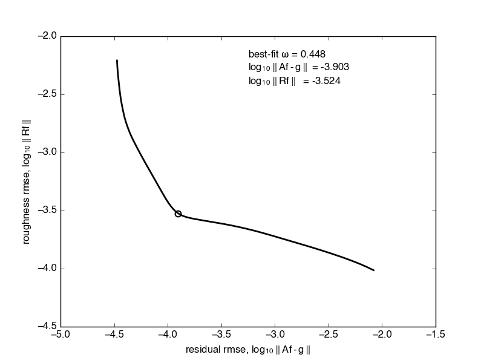
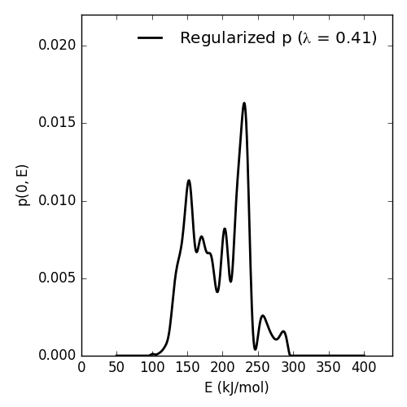
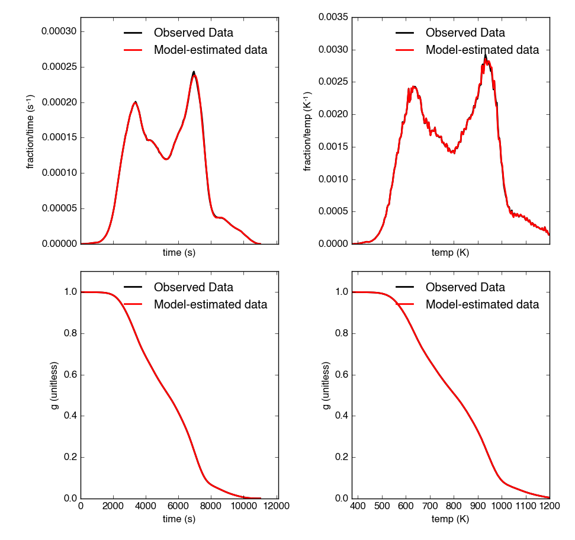
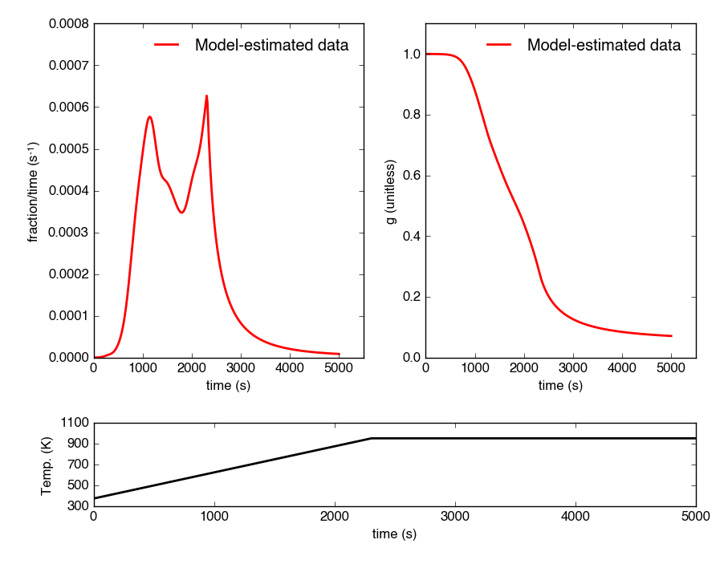
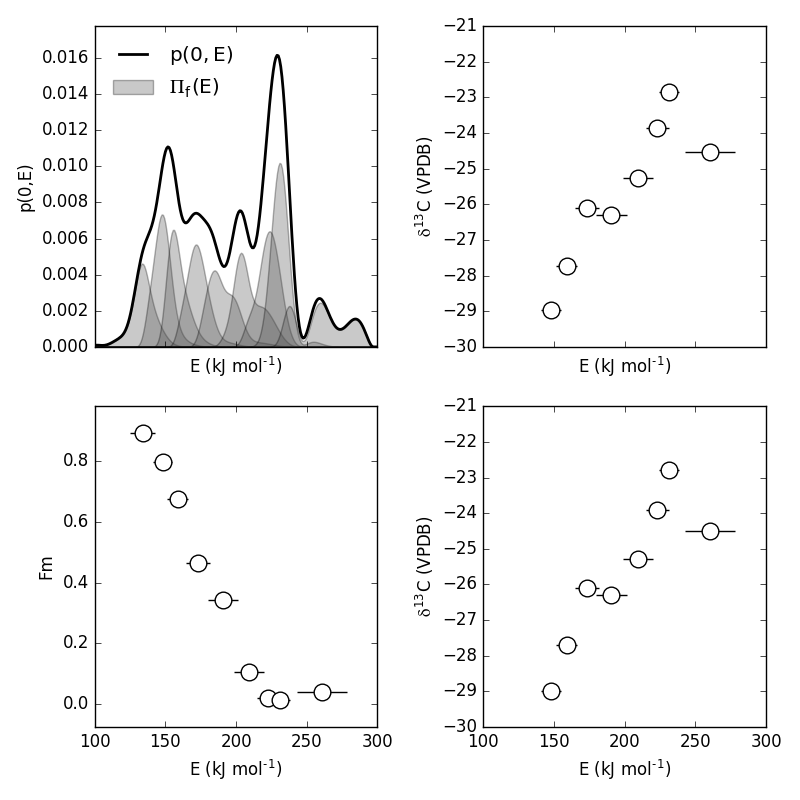

Comprehensive Walkthrough
=========================
The following examples should form a comprehensive walkthough of downloading the package, getting thermogram data into the right form for importing, running the DAEM inverse model to generate an activation energy (E) probability density function [p\ :sub:`0`\ (E)], determining the E range contained in each RPO fraction, correcting isotope values for blank and kinetic fractionation, and generating all necessary plots and tables for data analysis.

For detailed information on class attributes, methods, and parameters, consult the `Package Reference Documentation` or use the ``help()`` command from within Python.

Quick guide
-----------

Basic runthrough::

	#import modules
	import matplotlib.pyplot as plt
	import numpy as np
	import pandas as pd
	import rampedpyrox as rp

	#generate string to data
	tg_data = '/folder_containing_data/tg_data.csv'
	iso_data = '/folder_containing_data/iso_data.csv'

	#make the thermogram instance
	tg = rp.RpoThermogram.from_csv(
		tg_data,
		bl_subtract = True,
		nt = 250)

	#generate the DAEM
	daem = rp.Daem.from_timedata(
		tg,
		log10k0 = 10, #assume a constant value of 10
		E_max = 350,
		E_min = 50,
		nE = 400)

	#run the inverse model to generate an energy complex
	ec = rp.EnergyComplex.inverse_model(
		daem, 
		tg,
		omega = 'auto') #calculates best-fit omega

	#forward-model back onto the thermogram
	tg.forward_model(daem, ec)

	#calculate isotope results
	ri = rp.RpoIsotopes.from_csv(
		iso_data,
		daem,
		ec,
		blk_corr = True, #uses values for NOSAMS instrument
		bulk_d13C_true = [-24.9, 0.1], #true d13C value
		mass_err = 0.01,
		DE = 0.0018) #value from Hemingway et al., 2017

	#compare corrected isotopes and E values
	print(ri.ri_corr_info)

Downloading the package
-----------------------

Using the ``pip`` package manager
~~~~~~~~~~~~~~~~~~~~~~~~~~~~~~~~~
``rampedpyrox`` and the associated dependencies can be downloaded directly from the command line using ``pip``::

	$ pip install rampedpyrox

You can check that your installed version is up to date with the latest release by doing::

	$ pip freeze

Downloading from source
~~~~~~~~~~~~~~~~~~~~~~~
Alternatively, ``rampedpyrox`` source code can be downloaded directly from `my github repo <http://github.com/FluvialSeds/rampedpyrox>`_. Or, if you have git installed::

	$ git clone git://github.com/FluvialSeds/rampedpyrox.git

And keep up-to-date with the latest version by doing::

	$ git pull

from within the rampedpyrox directory.

Dependencies
~~~~~~~~~~~~
The following packages are required to run ``rampedpyrox``:

* `python <http://www.python.org>`_ >= 2.7, including Python 3.x

* `matplotlib <http://matplotlib.org>`_ >= 1.5.2

* `numpy <http://www.numpy.org>`_ >= 1.11.1

* `pandas <http://pandas.pydata.org>`_ >= 0.18.1

* `scipy <http://www.scipy.org>`_ >= 0.18.0

If downloading using ``pip``, these dependencies (except python) are installed
automatically.

Optional Dependencies
~~~~~~~~~~~~~~~~~~~~~
The following packages are not required but are highly recommended:

* `ipython <http://www.ipython.org>`_ >= 4.1.1

Additionally, if you are new to the Python environment or programming using the command line, consider using a Python integrated development environment (IDE) such as:

* `wingware <http://wingware.com>`_

* `Enthought Canopy <https://store.enthought.com/downloads/#default>`_

* `Anaconda <https://www.continuum.io/downloads>`_

* `Spyder <https://github.com/spyder-ide/spyder>`_

Python IDEs provide a "MATLAB-like" environment as well as package management. This option should look familiar for users coming from a MATLAB or RStudio background.

Getting data in the right format
--------------------------------

Importing thermogram data
~~~~~~~~~~~~~~~~~~~~~~~~~
For thermogram data, this package requires that the file is in `.csv` format, that the first column is `date_time` index in an **hh:mm:ss AM/PM** format, and that the file contains 'CO2_scaled' and 'temp' columns [1]_. For example:

+-------------+------------+--------------+
|  date_time  |    temp    |  CO2_scaled  |
+=============+============+==============+
|10:24:20 AM  |  100.05025 |    4.6       |
+-------------+------------+--------------+
|10:24:21 AM  |  100.09912 |    5.3       |
+-------------+------------+--------------+
|10:24:22 AM  |  100.11413 |    5.1       |
+-------------+------------+--------------+
|10:24:23 AM  |  100.22759 |    4.9       |
+-------------+------------+--------------+

Once the file is in this format, generate a string pointing to it in python 
like this::

	#create string of path to data
	tg_data = '/path_to_folder_containing_data/tg_data.csv'

Importing isotope data
~~~~~~~~~~~~~~~~~~~~~~
If you are importing isotope data, this package requires that the file is in `.csv` format and that the first two rows correspond to the starting time of the experiment and the initial trapping time of fraction 1, respectively. Additionally, the file must contain a 'fraction' column and isotope/mass columns must have `ug_frac`, `d13C`, `d13C_std`, `Fm`, and `Fm_std` headers. For example:

+-------------+----------+---------+--------+----------+--------+----------+
|  date_time  | fraction | ug_frac |  d13C  | d13C_std |   Fm   |  Fm_std  |
+=============+==========+=========+========+==========+========+==========+
|10:24:20 AM  |    -1    |    0    |    0   |    0     |    0   |     0    |
+-------------+----------+---------+--------+----------+--------+----------+
|10:45:10 AM  |     0    |    0    |    0   |    0     |    0   |     0    |
+-------------+----------+---------+--------+----------+--------+----------+
|11:32:55 AM  |     1    |  69.05  | -30.5  |   0.1    | 0.8874 |  0.0034  |
+-------------+----------+---------+--------+----------+--------+----------+
|11:58:23 AM  |     2    | 105.81  | -29.0  |   0.1    | 0.7945 |  0.0022  |
+-------------+----------+---------+--------+----------+--------+----------+

Here, the `ug_frac` column is composed of manometrically determined masses rather than those determined by the infrared gas analyzer (IRGA, *i.e.* photometric). **Important:** The `date_time` value for fraction '-1' must be the same as the `date_time` value for the first row in the `tg_data` thermogram file **and** the value for fraction '0' must the initial time when trapping for fraction 1 began.

Once the file is in this format, generate a string pointing to it in python like this::

	#create string of path to data
	iso_data = '/path_to_folder_containing_data/iso_data.csv'

Making a TimeData instance (the Thermogram)
-------------------------------------------
Once the `tg_data` string been defined, you are ready to import the package and generate an ``rp.RpoThermogram`` instance containing the thermogram data. ``rp.RpoThermogram`` is a subclass of ``rp.TimeData`` -- broadly speaking, this handles any object that contains measured time-series data. It is important to keep in mind that your thermogram will be down-sampled to `nt` points in order to smooth out high-frequency noise and to keep Laplace transform matrices to a manageable size for inversion (see `Setting-up the model`_ below). Additionally, because the inversion model is sensitive to boundary conditions at the beginning and end of the run, there is an option when generating the thermogram instance to ensure that the baseline has been subtracted. Note that temperature and ppm CO2 uncertainty is not inputted -- any noise is dealt with during regularization (see `Regularizing the inversion`_ below)::

	#load modules
	import rampedpyrox as rp

	#number of timepoints to be used in down-sampled thermogram
	nt = 250

	tg = rp.RpoThermogram.from_csv(
		data,
		bl_subtract = True, #subtract baseline
		nt = nt)

Plot the thermogram and the fraction of carbon remaining against temperature [2]_ or time::

	#load modules
	import matplotlib.pyplot as plt

	#make a figure
	fig, ax = plt.subplots(2, 2, 
		figsize = (8,8), 
		sharex = 'col')

	#plot results
	ax[0, 0] = tg.plot(
		ax = ax[0, 0], 
		xaxis = 'time',
		yaxis = 'rate')

	ax[0, 1] = tg.plot(
		ax = ax[0, 1], 
		xaxis = 'temp',
		yaxis = 'rate')

	ax[1, 0] = tg.plot(
		ax = ax[1, 0], 
		xaxis = 'time',
		yaxis = 'fraction')

	ax[1, 1] = tg.plot(
		ax = ax[1, 1], 
		xaxis = 'temp',
		yaxis = 'fraction')

	#adjust the axes
	ax[0, 0].set_ylim([0, 0.00032])
	ax[0, 1].set_ylim([0, 0.0035])
	ax[1, 1].set_xlim([375, 1200])

	plt.tight_layout()

Resulting plots look like this:

|realdata|

Additionally, thermogram summary info are stored in the `tg_info` attribute, which can be printed or saved to a .csv file::

	#print in the terminal
	print(tg.tg_info)

	#save to csv
	tg.tg_info.to_csv('file_name.csv')

This will create a table similar to:

+-------------------+-------------+
| t_max (s)         |  6.95e+03   |
+-------------------+-------------+
| t_mean (s)        |  5.33e+03   |
+-------------------+-------------+
| t_std (s)         |  1.93e+03   |
+-------------------+-------------+
| T_max (K)         |  9.36e+02   |
+-------------------+-------------+
| T_mean (K)        |  8.00e+02   |
+-------------------+-------------+
| T_std (K)         |  1.61e+02   |
+-------------------+-------------+
| max_rate (frac/s) |  2.43e-04   |
+-------------------+-------------+
| max_rate (frac/K) |  2.87e-04   |
+-------------------+-------------+

Setting-up the model
--------------------

The inversion transform
~~~~~~~~~~~~~~~~~~~~~
Once the ``rp.RpoThermogram`` instance has been created, you are ready to run the inversion model and generate a regularized and discretized probability density function (pdf) of the rate/activation energy distribution, `p`. For non-isothermal thermogram data, this is done using a first-order Distributed Activation Energy Model (DAEM) [3]_ by generating an ``rp.Daem`` instance containing the proper transform matrix, `A`, to translate between time and activation energy space [4]_. This matrix contains all the assumptions that go into building the DAEM inverse model as well as all of the information pertaining to experimental conditions (*e.g.* ramp rate) [5]_. Importantly, the transform matrix does not contain any information about the sample itself -- it is simply the model "design" -- and a single ``rp.Daem`` instance can be used for multiple samples provided they were analyzed under identical experimental conditions (however, this is not recommended, as subtle differences in experimental conditions such as ramp rate could exist).

One critical user input for the DAEM is the Arrhenius pre-exponential factor, *k\ :sub:`0`* (inputted here in log\ :sub:`10`\  form). Because there is much discussion in the literature over the constancy and best choice of this parameter (the so-called 'kinetic compensation effect' or KCE [6]_), this package allows *log\ :sub:`10`\ k\ :sub:`0`* to be inputted as a constant, an array, or a function of E.

For convenience, you can create any model directly from either time data or rate data, rather than manually inputting time, temperature, and rate vectors. Here, I create a DAEM using the thermogram defined above and allow E to range from 50 to 400 kJ/mol::

	#define log10k0, assume constant value of 10
	log10k0 = 10 #value advocated in Hemingway et al. (in prep)

	#define E range (in kJ/mol)
	E_min = 50
	E_max = 400
	nE = 400 #number of points in the vector

	#create the DAEM instance
	daem = rp.Daem.from_timedata(
		tg,
		log10k0 = log10k0,
		E_max = E_max,
		E_min = E_min,
		nE = nE)

Regularizing the inversion
~~~~~~~~~~~~~~~~~~~~~~~~~~
Once the model has been created, you must tell the package how much to 'smooth' the resulting p\ :sub:`0`\ (E) distribution. This is done by choosing an `omega` value to be used as a smoothness weighting factor for Tikhonov regularization [7]_. Higher values of `omega` increase how much emphasis is placed on minimizing changes in the first derivative at the expense of a better fit to the measured data, which includes analytical uncertainty. Rractically speaking, regularization aims to "fit the data while ignoring the noise." This package can calculate a best-fit `omega` value using the L-curve method [5]_.

Here, I calculate and plot L curve for the thermogram and model defined above::

	#make a figure
	fig,ax = plt.subplots(1, 1,
		figsize = (5, 5))

	om_best, ax = daem.calc_L_curve(
		tg,
		ax = ax,
		plot = True)

	plt.tight_layout()

Resulting L-curve plot looks like this, here with a calculated best-fit omega
value of 0.484:

|lcurve|

Making a RateData instance (the inversion results)
--------------------------------------------------
After creating the ``rp.Daem`` instance and deciding on a value for `omega`, you are ready to invert the thermogram and generate an Activation Energy Complex (EC). An EC is a subclass of the more general ``rp.RateData`` instance which, broadly speaking, contains all rate and/or activation energy information. That is, the EC contains an estimate of the underlying E distribution, p\ :sub:`0`\ (E), that is intrinsic to a particular sample for a particular degradation experiment type (*e.g.* combustion, *uv* oxidation, enzymatic degradation, etc.). A fundamental facet of this model is the realization that degradation of any given sample can be described by a distribution of reactivities as described by activation energy.

Here I create an energy complex with `omega` set to 'auto'::

	ec = rp.EnergyComplex.inverse_model(
		daem, 
		tg,
		omega = 'auto')

I then plot the resulting deconvolved energy complex::

	#make a figure
	fig,ax = plt.subplots(1, 1, 
		figsize = (5,5))

	#plot results
	ax = ec.plot(ax = ax)

	ax.set_ylim([0, 0.022])
	plt.tight_layout()

Resulting p\ :sub: `0`\ (E) looks like this:

|p0E|

EnergyComplex summary info are stored in the `ec_info` attribute, which can be printed or saved to a .csv file::

	#print in the terminal
	print(ec.ec_info)

	#save to csv
	ec.ec_info.to_csv('file_name.csv')

This will create a table similar to:

+-------------------+----------+
| E_max (kJ/mol)    |  230.45  |
+-------------------+----------+
| E_mean (kJ/mol)   |  194.40  |
+-------------------+----------+
| E_std (kJ/mol)    |  39.58   |
+-------------------+----------+
| p0(E)_max         |  0.02    |
+-------------------+----------+

Additionally, goodness of fit residual RMSE and roughness values can be viewed::

	#residual rmse for the model fit
	ec.resid

	#regularization roughness norm
	ec.rgh

Forward modeling the estimated thermogram
~~~~~~~~~~~~~~~~~~~~~~~~~~~~~~~~~~~~~~~~~
Once the ``rp.EnergyComplex`` instance has been created, you can forward-model the predicted thermogram and compare with measured data using the ``forward_model`` method of any ``rp.TimeData`` instance. For example::

	tg.forward_model(daem, ec)

The thermogram is now updated with modeled data and can be plotted::
	
	#make a figure
	fig, ax = plt.subplots(2, 2, 
		figsize = (8,8), 
		sharex = 'col')

	#plot results
	ax[0, 0] = tg.plot(
		ax = ax[0, 0], 
		xaxis = 'time',
		yaxis = 'rate')

	ax[0, 1] = tg.plot(
		ax = ax[0, 1], 
		xaxis = 'temp',
		yaxis = 'rate')

	ax[1, 0] = tg.plot(
		ax = ax[1, 0], 
		xaxis = 'time',
		yaxis = 'fraction')

	ax[1, 1] = tg.plot(
		ax = ax[1, 1], 
		xaxis = 'temp',
		yaxis = 'fraction')

	#adjust the axes
	ax[0, 0].set_ylim([0, 0.00032])
	ax[0, 1].set_ylim([0, 0.0035])
	ax[1, 1].set_xlim([375, 1200])

	plt.tight_layout()

Resulting plot looks like this:

|modeleddata|

Predicting thermograms for other time-temperature histories
~~~~~~~~~~~~~~~~~~~~~~~~~~~~~~~~~~~~~~~~~~~~~~~~~~~~~~~~~~~
One feature of the ``rampedpyrox`` package is the ability to forward-model degradation rates for any arbitrary time-temperature history once the estimated p\ :sub: `0`\ (E) distribution has been determined. This allows users the ability to:

* Quickly analyze a small amount of sample with a fast ramp rate in order to estimate p\ :sub: `0`\ (E), then forward-model the thermogram for a typical ramp rate of 5K/min in order to determine the best times to toggle gas collection fractions.

  * This feature could allow for future development of an automated Ramped PyrOx system.

* Manipulate oven ramp rates and temperature programs in an similar way to a gas chromatograph (GC) in order to separate co-eluting components, mimic real-world environmental heating rates, etc.

* Predict petroleum maturation and evolved gas isotope composition over geologic timescales [8]_.

Here, I will use the above-created p\ :sub: `0`\ (E) energy complex to generate a new DAEM with a ramp rate of 15K/min up to 950K, then hold at 950K::

	#import modules
	import numpy as np

	#extract the Ee array from the energy complex
	E = ec.E

	#make an array of 350 points going from 0 to 5000 seconds
	t = np.linspace(0, 5000, 350)

	#calculate the temperature at each timepoint, starting at 373K
	T = 373 + (15./60)*t

	ind = np.where(T > 950)
	T[ind] = 950

	#use the same log10k0 value as before
	log10k0 = 10

	#make the new model
	daem_fast = rp.Daem(
		E,
		log10k0,
		t,
		T)

	#make a new thermogram instance by inputting the time 
	# and temperature arrays. This "sets up" the thermogram
	# for forward modeling
	tg_fast = rp.RpoThermogram(t, T)

	#forward-model the energy complex onto the new thermogram
	tg_fast.forward_model(daem_fast, ec)

**Note:** Because a portion of this time-temperature history is isothermal, this calculation will inevitably divide by `0` while calculating some metrics. As a result, it will generate some warnings and will fail to calculate an average decay temperature. Results plotted against time are still valid and robust.

The `tg_fast` thermogram now contains modeled data and can be plotted::
	
	#import additional modules
	import matplotlib.gridspec as gridspec

	#make a figure
	gs = gridspec.GridSpec(2, 2, height_ratios=[4,1])

	ax1 = plt.subplot(gs[0,0])

	ax2 = plt.subplot(gs[0,1])

	ax3 = plt.subplot(gs[1,:])

	#plot results
	ax1 = tg_fast.plot(
		ax = ax1, 
		xaxis = 'time',
		yaxis = 'rate')

	ax2 = tg_fast.plot(
		ax = ax2, 
		xaxis = 'time',
		yaxis = 'fraction')

	#plot time-temperature history
	ax3.plot(
		tg_fast.t,
		tg_fast.T,
		linewidth = 2,
		color = 'k')

	#set labels
	ax3.set_xlabel('time (s)')
	ax3.set_ylabel('Temp. (K)')

	#adjust the axes
	ax1.set_ylim([0, 0.0008])
	ax3.set_yticks([300, 500, 700, 900, 1100])

	plt.tight_layout()

Which generates a plot like this:

|fastmodeleddata|

Importing and correcting isotope values
---------------------------------------
At this point, the thermogram, DAEM model, and p\ :sub: `0`\ (E) distribution have all been created. Now, the next step is to import the RPO isotope values and to calculate the distribution of E values corresponding to each RPO fraction. This is This is done by creating an ``rp.RpoIsotopes`` instance using the ``from_csv`` method. If the sample was run on the NOSAMS Ramped PyrOx instrument, setting ``blank_corr = True`` and an appropriate value for ``mass_rerr`` will automatically blank-correct values according to the blank carbon estimation of Hemingway et al. (2017) [9]_ [10]_. Additionally, if :sup:`13`\ C isotope composition was measured, these can be further corrected for any mass-balance discrepancies and for kinetic isotope fractionation within the RPO instrument [5]_ [9]_.

Here I create an ``rp.RpoIsotopes`` instance and input the measured data::
	
	ri = rp.RpoIsotopes.from_csv(
		iso_data,
		daem,
		ec,
		blk_corr = True,
		bulk_d13C_true = [-25.0, 0.1], #independently measured true mean, std.
		mass_err = 0.01, #1 percent uncertainty in mass
		DE = 0.0018) #1.8 J/mol for KIE 

While creating the `RpoIsotopes` instance and correcting isotope composition, this additionally calculated the distribution of E values contained within each RPO fraction. That is, carbon described by this distribution will decompose over the inputted temperature ranges and will result in the trapped CO\ :sub:`2`\ for each fraction [5]_. These distributions can now be compared with measured isotopes in order to determine the relationship between isotope composition and reaction energetics.

A summary table can be printed or saved to .csv according to::

	#print to terminal
	print(ri.ri_corr_info)

	#save to .csv file
	ri.ri_corr_info.to_csv('file_to_save.csv')

**Note:** This displays the fractionation, mass-balance, and KIE corrected isotope values. To view raw (inputted) values, use `ri_raw_info` instead.

This will result in a table similar to:

+---+------+------+----------+-----+----------+---------+-----------+---------+-----+--------+
|   |t0 (s)|tf (s)|E (kJ/mol)|E_std|mass (ugC)|mass_std |d13C (VPDB)|d13C_std |Fm   |Fm_std  |
+===+======+======+==========+=====+==========+=========+===========+=========+=====+========+
| 1 |754   |2724  | 134.12   |8.83 | 68.32    | 0.70    | -29.40    | 0.15    |0.89 |3.55e-3 |
+---+------+------+----------+-----+----------+---------+-----------+---------+-----+--------+
| 2 |2724  |3420  | 148.01   |6.96 | 105.55   | 1.06    | -27.99    | 0.15    |0.80 |2.21e-3 |
+---+------+------+----------+-----+----------+---------+-----------+---------+-----+--------+
| 3 |3420  |3966  | 158.84   |7.47 | 82.42    | 0.83    | -26.76    | 0.15    |0.68 |2.81e-3 |
+---+------+------+----------+-----+----------+---------+-----------+---------+-----+--------+
| 4 |3966  |4718  | 173.13   |8.55 | 92.56    | 0.93    | -25.14    | 0.15    |0.46 |3.21e-3 |
+---+------+------+----------+-----+----------+---------+-----------+---------+-----+--------+
| 5 |4718  |5553  | 190.67   |10.82| 85.56    | 0.86    | -25.33    | 0.15    |0.34 |2.82e-3 |
+---+------+------+----------+-----+----------+---------+-----------+---------+-----+--------+
| 6 |5553  |6328  | 209.20   |10.59| 98.43    | 0.98    | -24.29    | 0.15    |0.11 |2.22e-3 |
+---+------+------+----------+-----+----------+---------+-----------+---------+-----+--------+
| 7 |6328  |6940  | 222.90   |8.12 | 101.50   | 1.01    | -22.87    | 0.15    |0.02 |1.91e-3 |
+---+------+------+----------+-----+----------+---------+-----------+---------+-----+--------+
| 8 |6940  |7714  | 231.30   |7.13 | 125.57   | 1.26    | -21.88    | 0.15    |0.01 |1.81e-3 |
+---+------+------+----------+-----+----------+---------+-----------+---------+-----+--------+
| 9 |7714  |11028 | 260.63   |17.77| 86.55    | 0.90    | -23.57    | 0.16    |0.04 |2.42e-3 |
+---+------+------+----------+-----+----------+---------+-----------+---------+-----+--------+

Additionally, the E distributions contained within each RPO fraction can be plotted along with isotope vs. E cross plots. Here, I'll plot the distributions and cross plots for both :sup:`13`\ C and :sup:`14`\ C (corrected). Lastly, I'll plot using the raw (uncorrected) :sup:`13`\ C values as a comparison::

	#make a figure
	fig, ax = plt.subplots(2, 2, 
		figsize = (8,8), 
		sharex = True)

	#plot results
	ax[0, 0] = ri.plot(
		ax = ax[0, 0], 
		plt_var = 'p0E')

	ax[0, 1] = ri.plot(
		ax = ax[0, 1], 
		plt_var = 'd13C',
		plt_corr = True)

	ax[1, 0] = ri.plot(
		ax = ax[1, 0], 
		plt_var = 'Fm',
		plt_corr = True)

	ax[1, 1] = ri.plot(
		ax = ax[1, 1], 
		plt_var = 'd13C',
		plt_corr = False) #plotting raw values

	#adjust the axes
	ax[0,0].set_xlim([100,300])
	ax[0,1].set_ylim([-30,-21])
	ax[1,1].set_ylim([-30,-21])

	plt.tight_layout()

Which generates a plot like this:

|isotopes|

Additional Notes on the Kinetic Isotope Effect (KIE)
~~~~~~~~~~~~~~~~~~~~~~~~~~~~~~~~~~~~~~~~~~~~~~~~~~~~
While the KIE has no effect on Fm values since they are fractionation-corrected by definition [11]_, mass-dependent kinetic fractionation effects must be explicitly accounted for when estimating the source carbon stable isotope composition during any kinetic experiment. For example, the KIE can lead to large isotope fractionation during thermal generation of methane and natural gas over geologic timescales [8]_ or during photodegradation of organic carbon by *uv* light [15]_.

As such, the ``rampedpyrox`` package allows for direct input of `DE` values [DE = E(:sup:`13`\ C) - E(:sup:`12`\ C), in kJ/mol] when correcting Ramped PyrOx isotopes. However, the magnitude of this effect is likely minimal within the NOSAMS Ramped PyrOx instrument -- Hemingway et al. (2017) determined a best-fit value of 0.3e-3 - 1.8e-3 kJ/mol for a suite of standard reference materials [9]_ -- and will therefore lead to small isotope corrections for samples analyzed on this instrument (*i.e.* << 1 per mille)

Notes and References
--------------------

.. |realdata| image:: _images/doc_realdata.png

.. [1] Note: If analyzing samples run at NOSAMS, all other columns in the `tg_data` file generated by LabView are not used and can be deleted or given an arbitrary name.

.. [2] Note: For the NOSAMS Ramped PyrOx instrument, plotting against temperature results in a noisy thermogram due to the variability in the ramp rate, dT/dt.

.. [3] Braun and Burnham (1999), *Energy & Fuels*, **13(1)**, 1-22 provides a comprehensive review of the kinetic theory, mathematical derivation, and forward-model implementation of the DAEM. 

.. [4] See Forney and Rothman (2012), *Biogeosciences*, **9**, 3601-3612 for information on building and regularizing a Laplace transform matrix to be used to solve the inverse model using the L-curve method.

.. [5] See Hemingway et al. **(in prep)** for a step-by-step mathematical derivation of the DAEM and the inverse solution applied here.

.. [6] See White et al. (2011), *J. Anal. Appl. Pyrolysis*, **91**, 1-33 for a review on the KCE and choice of *log\ :sub:`10`\ k\ :sub:`0`*.

.. [7] See Hansen (1994), *Numerical Algorithms*, **6**, 1-35 for a discussion on Tikhonov regularization.

.. [8] See Dieckmann (2005) *Marine and Petroleum Geology*, **22**, 375-390 and Dieckmann et al. (2006) *Marine and Petroleum Gelogoy*, **23**, 183-199 for a discussion on the limitations of predicting organic carbon maturation over geologic timescales using laboratory experiments.

.. [9] Hemingway et al., (2017), *Radiocarbon*, determine the blank carbon flux and isotope composition for the NOSAMS instrument. Additionaly, this manuscript estimates that a DE value of 0.3 - 1.8 J/mol best explains the NOSAMS Ramped PyrOx stable-carbon isotope KIE.

.. [10] Blank composition calculated for other Ramped PyrOx instuments can be inputted by changing the default ``blk_d13C``, ``blk_flux``, and ``blk_Fm`` parameters.

.. [11] See Stuiver and Polach (1977), *Radiocarbon*, **19(3)**, 355-363 for radiocarbon notation and data treatment.
