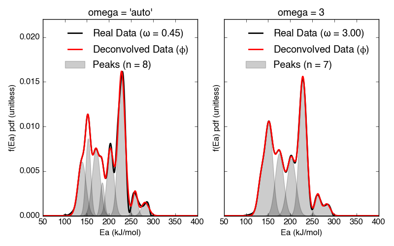
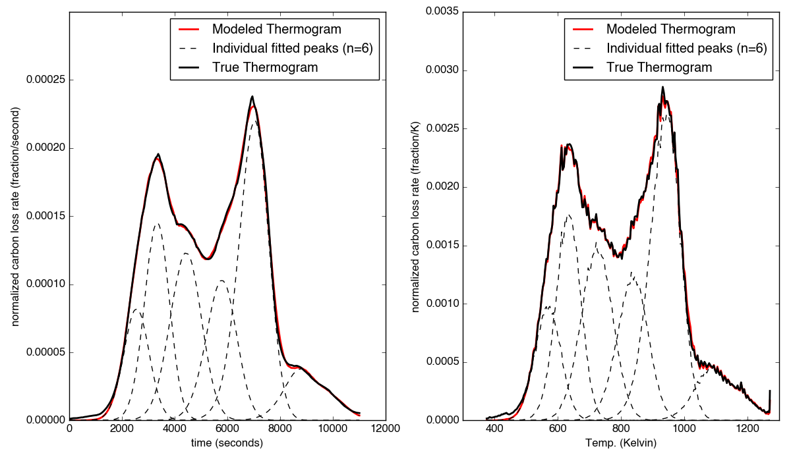

Comprehensive Walkthrough
=========================
The following examples should form a comprehensive walkthough of downloading
the package, getting thermogram data into the right form for importing,
running the DAEM inverse model, peak-fitting the activation energy (Ea) 
probability density function, determining the isotope composition of each Ea 
Gaussian peak, and performing Monte Carlo uncertainty estimates.

Downloading the package
-----------------------

Using the ``pip`` package manager
~~~~~~~~~~~~~~~~~~~~~~~~~~~~~~~~~
(coming with first full release)
``rampedpyrox`` and the associated dependent packages can be downloaded
directly from the command line using ``pip``::

	pip install rampedpyrox

Downloading from source
~~~~~~~~~~~~~~~~~~~~~~~
Alternatively, ``rampedpyrox`` source code can be downloaded directly from
`my github repo <http://github.com/FluvialSeds/rampedpyrox>`_. Or, if you have
git installed::

	$ git clone git://github.com/FluvialSeds/rampedpyrox.git

And keep up-to-date with the latest version by doing::

	$ git pull

from within the rampedpyrox directory. You can check that your installed 
version is up to date with the latest release by doing::

	$ git freeze

Dependencies
~~~~~~~~~~~~
The following packages are required to run ``rampedpyrox``:

* `python <http://www.python.org>`_ >= 2.7, including Python 3.x

* `matplotlib <http://matplotlib.org>`_ >= 1.5.2

* `numpy <http://www.numpy.org>`_ >= 1.11.1

* `pandas <http://pandas.pydata.org>`_ >= 0.18.1

* `scipy <http://www.scipy.org>`_ >= 0.18.0

If downloading using ``pip``, these dependencies (except python) are installed
automatically.

Optional Dependencies
~~~~~~~~~~~~~~~~~~~~~
The following packages are not required but are highly recommended:

* `ipython <http://www.ipython.org>`_ >= 4.1.1

Getting data in the right format
--------------------------------

Importing thermogram data
~~~~~~~~~~~~~~~~~~~~~~~~~
For thermogram data (*i.e.* an `all_data` file), this package requires that
the file is in `.csv` format, that the first column is `date_time` index in an
**hh:mm:ss AM/PM** format, and that the file contains 'CO2_scaled' and 'temp' 
columns [1]_. For example:

+-------------+------------+--------------+
|  date_time  |    temp    |  CO2_scaled  |
+=============+============+==============+
|10:24:20 AM  |  100.05025 |    4.6       |
+-------------+------------+--------------+
|10:24:21 AM  |  100.09912 |    5.3       |
+-------------+------------+--------------+
|10:24:22 AM  |  100.11413 |    5.1       |
+-------------+------------+--------------+
|10:24:23 AM  |  100.22759 |    4.9       |
+-------------+------------+--------------+

Once the file is in this format, generate a string pointing to it in python 
like this::

	#create string of path to data
	all_data = '/path_to_folder_containing_data/all_data.csv'

Importing isotope data
~~~~~~~~~~~~~~~~~~~~~~
If you are importing isotope data (*i.e.* a `sum_data` file), this package 
requires that the file is in `.csv` format and that the first two rows 
correspond to the starting time of the experiment and the initial trapping
time of fraction 1, respectively. Additionally, the file must contain the 
columns: 'fraction', 'ug_frac', 'd13C', 'd13C_std', 'Fm', and 'Fm_std' [2]_.
For example:

+-------------+----------+---------+--------+----------+--------+----------+
|  date_time  | fraction | ug_frac |  d13C  | d13C_std |   Fm   |  Fm_std  |
+=============+==========+=========+========+==========+========+==========+
|10:24:20 AM  |    -1    |    0    |    0   |    0     |    0   |     0    |
+-------------+----------+---------+--------+----------+--------+----------+
|10:45:10 AM  |     0    |    0    |    0   |    0     |    0   |     0    |
+-------------+----------+---------+--------+----------+--------+----------+
|11:32:55 AM  |     1    |  69.05  | -30.5  |   0.1    | 0.8874 |  0.0034  |
+-------------+----------+---------+--------+----------+--------+----------+
|11:58:23 AM  |     2    | 105.81  | -29.0  |   0.1    | 0.7945 |  0.0022  |
+-------------+----------+---------+--------+----------+--------+----------+

**Important:** The `date_time` value for fraction '-1' must be the same as the 
`date_time` value for the first row in `all_data` **and** the value for
fraction '0' must the initial time when trapping for fraction 1 began.

Once the file is in this format, generate a string pointing to it in python
like this::

	#create string of path to data
	sum_data = '/path_to_folder_containing_data/sum_data.csv'

Making a RealData instance
--------------------------
Once the ``all_data`` string been defined, you are ready to import the package
and generate an ``rp.RealData`` instance containing the thermogram data.

It is important to keep in mind that your thermogram will be down-sampled to
`nT` points in order to smooth out high-frequency noise and to keep Laplace
transform matrices to a manageable size for inversion (see `Generating the
f(Ea) distribution`_ below). Additionally, normally distributed noise can be 
generated for estimating uncertainty (see 
`Monte Carlo uncertainty estimation`). Here, I'll leave the ``add_noise_pct`` 
flag at the default value of `0` (*i.e.* no noise)::

	#load modules
	import rampedpyrox as rp

	#number of timepoints to be used in down-sampled thermogram
	nT = 250

	#save to RealData instance
	rd = rp.RealData(all_data, nT=nT, add_noise_pct=0)

Plot the thermogram against temperature [3]_ or time::

	#load modules
	import matplotlib.pyplot as plt

	#make a figure
	fig,ax = plt.subplots(1,2)

	#plot results
	ax[0] = rd.plot(ax=ax[0], xaxis='time')
	ax[1] = rd.plot(ax=ax[1], xaxis='temp')

	plt.tight_layout()

Resulting plot looks like this:

|realdata|

Generating the f(Ea) distribution
---------------------------------

The Laplace transform
~~~~~~~~~~~~~~~~~~~~~
Once the ``rp.RealData`` instance has been created, you are ready to run
the inversion model to generate a regularized and discretized probability
density function (pdf) of the Ea distribution, `phi` [4]_. This is done by
generating an ``rp.LaplaceTransform`` instance containing the Laplace
transform matrix to translate between time and Ea space. This matrix contains 
all the assumptions that go into building the DAEM inverse model as well as
all of the information pertaining to experimental conditions (*e.g.* ramp
rate) -- that is, it is the 'heart' of the model [5]_.

One critical user input for the DAEM is the Arrhenius pre-exponential factor,
`k0` (inputted here as log10). Because there is much discussion in the 
literature over the constancy and best choice of this parameter (the so-
called 'kinetic compensation effect' or KCE [6]_), this package allows `logk0`
to be inputted as a constant, an array, or a function of Ea.

Define an Ea array `eps` and `logk0` value, and generate an 
``rp.LaplaceTransform`` instance in python using the ``rp.RealData`` 
instance, `rd`, defined above::

	#load modules
	import numpy as np

	#Ea range to calculate over, in kJ/mol
	eps = np.arange(50,350)
	
	#log of the pre-exponential (Arrhenius) factor, in inverse seconds
	logk0 = 10.
	
	lt = rp.LaplaceTransform(rd.t,rd.Tau,eps,logk0)

Regularizing f(Ea)
~~~~~~~~~~~~~~~~~~
Once the ``rp.LaplaceTransform`` instance has been created, you must tell the
package how much to 'smooth' the resulting f(Ea) distribution. This is done
by choosing an `omega` value to be used as a smoothness weighting factor for 
Tikhonov regularization [7]_. This package can calculate a best-fit `omega` 
value using the L-curve method [5]_ by doing::

	#make a figure
	fig,ax = plt.subplots(1,1)

	#calculate and plot L curve for RealData rd and LaplaceTransform lt
	om_best, ax = lt.plot_L_curve(rd, ax=ax)

Resulting L-curve plot looks like this, here with a calculated best-fit omega
value of 0.534:

|lcurve|

**Important:** Best-fit `omega` values generated by the L-curve method 
typically under-regularize f(Ea) with respect to Ramped PyrOx isotope 
deconvolution. That is, f(Ea) distributions will contain more Gaussian peaks 
than can be resolved using the ~5-7 CO2 fractions typically collected during 
a Ramped PyrOx run. This can be partially addressed by combining high-Ea 
peaks using the `combine_last` flag when creating an ``rp.EnergyComplex`` 
instance (see `Generating and plotting f(Ea)`_ below), as this region 
typically contains low isotope resolution. Alternatively, you can increase 
`omega` (a value of ~1-5 will result in ~5-6 Gaussian peaks for most samples).

Generating and plotting f(Ea)
~~~~~~~~~~~~~~~~~~~~~~~~~~~~~
After creating the ``rp.LaplaceTransform`` instance and deciding a value for 
`omega`, you are ready to invert the thermogram data by executing the 
``calc_EC_inv`` method from within the ``rp.LaplaceTransform`` instance. 
Here, I'll show the results for ``omega='auto'`` as well as ``omega=3``::

	#run the inverse model with omega = auto
	phi_auto, resid_err_auto, rgh_err_auto, om_best = lt.calc_EC_inv(
		rd, omega='auto')

	#run the inverse model with omega = 3
	phi_3, resid__err_3, rgh_err_3, _ = lt.calc_EC_inv(
		rd, omega=3)

Deconvolving f(Ea) into Gaussians
---------------------------------
The next step is to deconvolve the f(Ea) distribution into individual 
Gaussian peaks. It is important to realize that, until now, the model has 
made no assumptions about the shape of f(Ea) or the DAEM energy complexes 
that it consists of. The fact that the regularized f(Ea) resembles a sum of 
Gaussian peaks appears to be a fundamental property of complex organic carbon 
mixtures, as has been assumed before [8]_.

Generate an ``rp.EnergyComplex`` instance to perform the Gaussian 
deconvolution and plot results. Here, I'll let ``nPeaks='auto'`` and 
``thres=0.02`` to allow the model to automatically select peaks above 2\% of 
the height of the tallest peak. Additionally I'll combine the last 2 peaks 
and set ``DEa=0.0018`` (see `Kinetic Isotope Effect (KIE)`_ below for further 
discussion on `DEa` [9]_)::

	#deconvolving phi generated with omega = auto
	ec_auto = rp.EnergyComplex(eps, phi_auto,
		nPeaks='auto',
		thres=0.02,
		combine_last=2,
		DEa=0.0018)

	#deconvolving phi generated with omega = 3
	ec_3 = rp.EnergyComplex(eps, phi_3,
		nPeaks='auto',
		thres=0.02,
		combine_last=2,
		DEa=0.0018)

Plot the resulting deconvolved f(Ea)::

	#make a figure
	fig,ax = plt.subplots(1, 2, sharey = True)

	#plot results
	ax[0] = ec_auto.plot(ax=ax[0])
	ax[1] = ec_3.plot(ax=ax[1])

	ax[0].set_title("omega = 'auto'")
	ax[1].set_title("omega = 3")
	plt.tight_layout()

Resulting plots are shown side-by-side:

|phis|

Note that the number of 'Individual Fitted Gaussians' reported in the legend 
is before the ``combine_last`` flag has been implemented. The last 2 peaks 
are combined in the plot.

A summary of the Gaussian peaks can be printed with the ``summary`` method::

	ec_3.summary()

Which will print a table similar to:

+------------------------------------------------------------+
|Peak information for each deconvolved peak:                 |
+============================================================+
|NOTE: Combined peaks are reported separately in this table! |
+-----+-------------+---------------+----------+-------------+
|     | means (kJ)  |  stdev. (kJ)  |  height  |  rel. area  |
+-----+-------------+---------------+----------+-------------+
|  1  |  136.205501 |   8.575766    | 0.004625 |  0.099750   |
+-----+-------------+---------------+----------+-------------+
|  2  |  152.302553 |   7.628098    | 0.009002 |  0.172695   |
+-----+-------------+---------------+----------+-------------+
|  3  |  174.969866 |   10.273746   | 0.007160 |  0.184946   |
+-----+-------------+---------------+----------+-------------+
|  4  |  203.113455 |   9.232788    | 0.006471 |  0.150222   |
+-----+-------------+---------------+----------+-------------+
|  5  |  228.741877 |   8.167253    | 0.015281 |  0.313914   |
+-----+-------------+---------------+----------+-------------+
|  6  |  261.304757 |   6.178408    | 0.002498 |  0.038820   |
+-----+-------------+---------------+----------+-------------+
|  7  |  284.249535 |   11.393354   | 0.001384 |  0.039653   |
+-----+-------------+---------------+----------+-------------+
| Deconvolution RMSE = 4.59 x 10^-6                          |
+------------------------------------------------------------+

Forward modeling estimated thermogram
~~~~~~~~~~~~~~~~~~~~~~~~~~~~~~~~~~~~~
Once the ``rp.EnergyComplex`` instance has been created, you can use the 
``calc_TG_fwd`` method to forward model the estimated thermogram and store in 
an ``rp.ModeledData`` instance. Here, I'll forward model the results from the 
``omega = 3`` energy complex::

	md = lt.calc_TG_fwd(ec_3)

Similar to ``rp.RealData``, you can plot this thermogram against temperature 
[3]_ or time, and can even overlay the true thermogram::

	#make a figure
	fig,ax = plt.subplots(1,2)

	#plot modeled results
	ax[0] = md.plot(ax=ax[0], xaxis='time')
	ax[1] = md.plot(ax=ax[1], xaxis='temp')

	#overlay true thermogram
	ax[0] = rd.plot(ax=ax[0], xaxis='time')
	ax[1] = rd.plot(ax=ax[1], xaxis='temp')

	plt.tight_layout()

Resulting plot looks like this:

|modeleddata|

Similar to ``rp.EnergyComplex``, you can print a summary of the 
``rp.ModeledData`` instance::

	md.summary()

Which will print a table similar to:

+------------------------------------------------------------+
|max time, max temp, and rel. area for each deconvolved peak:|
+============================================================+
|NOTE: Combined peak results are represented as one in table!|
+-----+--------------------+-------------------+-------------+
|     |   time (seconds)   |   temp (Kelvin)   |  rel. area  |
+-----+--------------------+-------------------+-------------+
|  1  |      2582.658      |     571.285152    |   0.099844  |
+-----+--------------------+-------------------+-------------+
|  2  |      3333.174      |     633.601584    |   0.172858  |
+-----+--------------------+-------------------+-------------+
|  3  |      4392.726      |     721.286327    |   0.185120  |
+-----+--------------------+-------------------+-------------+
|  4  |      5761.314      |     835.613286    |   0.150364  |
+-----+--------------------+-------------------+-------------+
|  5  |      7041.606      |     943.251295    |   0.314209  |
+-----+--------------------+-------------------+-------------+
|  6  |      8807.526      |    1089.759802    |   0.077605  |
+-----+--------------------+-------------------+-------------+

Determining peak isotope composition
------------------------------------
At this point, the thermogram has been deconvolved into energy complexes 
according to the DAEM and the isotope composition of each energy complex can 
be determined using the `sum_data` file imported previously (see `Importing 
Isotope Data` above). Isotope results are stored in an ``rp.IsotopeResult`` 
class instance.

If the sample was run on the NOSAMS Ramped PyrOx instrument, setting
``blank_corr = True`` and an appropriate value for ``mass_rsd`` will 
automatically blank-correct values according to the blank carbon estimation 
of Hemingway et al. **(in prep)** [9]_. Additionally, setting 
``add_noise = True`` will generate normally distributed uncertainty in 
isotope values using the inputted isotope uncertainty (see `Monte Carlo 
uncertainty estimation` below for further details).

Estimate isotope values using `sum_data`::

	ir = rp.IsotopeResult(sum_data,lt, ec, 
 		blk_corr=True,
 		mass_rsd=0.01,
 		add_noise=False)

You can print the estimates like this::

	ir.summary()

Which prints a table similar to:

+------------------------------------------------------------+
|Isotope and mass estimates for each deconvolved peak:       |
+============================================================+
|NOTE: Combined peak results are repeated in summary table!  |
+-----+--------------------+-------------------+-------------+
|     |      mass (ugC)    |        d13C       |      Fm     |
+-----+--------------------+-------------------+-------------+
|  1  |      84.555698     |     -30.843315    |   0.929585  |
+-----+--------------------+-------------------+-------------+
|  2  |      146.389053    |     -28.449830    |   0.776570  |
+-----+--------------------+-------------------+-------------+
|  3  |      156.773838    |     -25.998722    |   0.460255  |
+-----+--------------------+-------------------+-------------+
|  4  |      127.339722    |     -26.188432    |   0.176751  |
+-----+--------------------+-------------------+-------------+
|  5  |      266.096470    |     -23.059327    |   0.000000  |
+-----+--------------------+-------------------+-------------+
|  6  |      32.907006     |     -24.495371    |   0.058753  |
+-----+--------------------+-------------------+-------------+
|  7  |      33.612607     |     -24.495371    |   0.058753  |
+-----+--------------------+-------------------+-------------+

You can also print the regression RMSEs::
	
	print(ir.RMSEs)

Which results in something similar to:

+------+------------+
|      |    RMSE    |
+======+============+
| mass |  3.536239  |
+------+------------+
| d13C |  0.149527  |
+------+------------+
| Fm   |  0.015916  |
+------+------------+

Kinetic Isotope Effect (KIE)
~~~~~~~~~~~~~~~~~~~~~~~~~~~~
While the KIE has no effect on Fm values, as they are fractionation-corrected 
by definition [10]_, the above caclulation explicitly incorporates 
mass-dependent kinetic fractionation effects when calculating stable-carbon 
isotope ratios by using the `DEa` value inputted into the ``rp.EnergyComplex``
instance. While the KIE is potentially important during the pyrolysis of 
organic matter to form hydrocarbons over geologic timescales [8]_, the 
magnitude of this effect is likely minimal within the NOSAMS Ramped PyrOx 
instrument [9]_ and will therefore lead to small corrections in isotope 
values (*i.e.* less than 1 per mille).

Monte Carlo uncertainty estimation
----------------------------------

Saving the output
-----------------

.. Notes and substitutions

.. |realdata| image:: _images/doc_realdata.png

.. |lcurve| image:: _images/doc_Lcurve.png

.. [1] Note: If analyzing samples run at NOSAMS, all other columns in the 
	`all_data` file generated by LabView are not used and can be deleted or 
	given an arbitrary name.

.. [2] Note: 'd13C_std' and 'Fm_std' are unused if passed into an 
	``rp.IsotopeResult`` instance with ``add_noise=False``.

.. [3] Note: For the NOSAMS Ramped PyrOx instrument, plotting against temp.
	results in a noisy thermogram due to the variability in the ramp rate,
	dT/dt.

.. [4] Note: Throughout this package, continuous variables are named with
	Roman letters -- *e.g.* f(Ea) (Ea pdf), T (temp) -- and corresponding 
	discretized variables are named with Greek letters -- *e.g.* phi (Ea pdf),
	Tau (temp). Additionally, fitted model estimates end in `_hat` -- *e.g.* 
	phi_hat.

.. [5] See Forney and Rothman, (2012), *Biogeosciences*, **9**, 3601-3612
	for information on building and regularizing a Laplace transform matrix
	using the L-curve method.

.. [6] See White et al., (2011), *J. Anal. Appl. Pyrolysis*, **91**, 1-33 for
	a review on the KCE and choice of `logk0`.

.. [7] See Hansen (1994), *Numerical Algorithms*, **6**, 1-35 for a discussion
	on Tikhonov regularization.

.. [8] See Cramer, (2004), *Org. Geochem.*, **35**, 379-392 for a discussion 
	on the relationship between Gaussian Ea peak shape and organic carbon 
	complexity, as well as the KIE.

.. [9] Hemingway et al., (2016), *Radiocarbon*, **in prep** determine that a 
	DEa value of 1.8J/mol best explains the NOSAMS Ramped PyrOx stable-carbon 
	isotope KIE, in addition to determining the blank carbon contribution for 
	this instrument.

.. [10] Stuiver and Polach (1977), *Radiocarbon*, **19(3)**, 355-363 is 
	generally accepted as the standard reference on radiocarbon notation.

